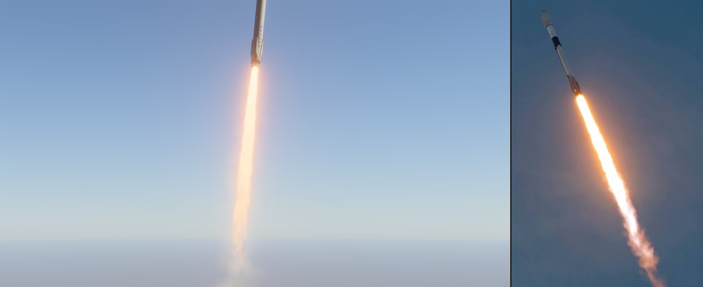
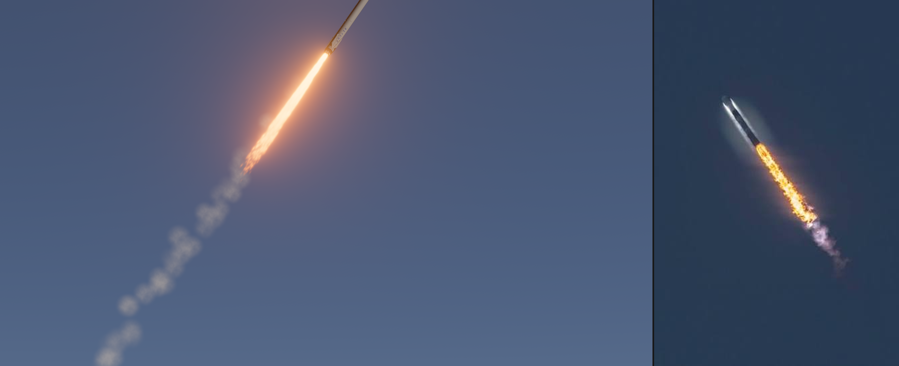
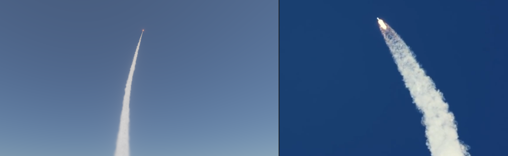

# pyrotechnique

A 3D HDR particle-effect design tool for [Bevy Hanabi](https://github.com/djeedai/bevy_hanabi),
built for both humans and AI agents. Author GPU particle effects as plain
`.effect` RON files, see them live on a real vehicle model in an HDR
bloom-lit environment, and capture deterministic screenshots to compare
against reference photos.

Work is organized into **projects**. Four ship built in:

- **falcon9** — SpaceX Falcon 9 flying an animated launch profile with four
  layered exhaust effects, tuned against real launch photography.
- **apollo-lander** — Apollo Lunar Module powered descent on an airless Moon:
  vacuum descent plume, pulsed RCS quads, and a ballistic regolith dust sheet,
  tuned against film and simulation references.
- **rocket** — 2 m model rocket, 6 s boost, motor core/flame plus launch smoke.
- **satellite** — OreSat in LEO against true-scale Earth. Stars, Milky Way,
  city lights, and airglow are Hanabi particles (no cubemap); a 90 s sim
  orbit is one compressed day/night cycle.





## Stack

| Piece | Version | Why it matters |
|---|---|---|
| Bevy | 0.19 | HDR camera, bloom, procedural atmosphere, screenshot API |
| bevy_hanabi | 0.19 | GPU particles + first-class `.effect` RON serialization |
| bevy_egui | 0.40 | Editor panels |
| bevy_panorbit_camera | 0.35 | Viewport orbit controls |

## Projects

A project is a name that resolves by convention:

```text
assets/scenes/<project>.scene.ron     the scene (model, emitters, flight, scenarios)
assets/effects/<project>/*.effect     the project's tunable effect files
targets/<project>/                    reference images scenarios compare against
shots/<project>/                      capture + screenshot output (gitignored)
```

Shared across projects: `assets/models/` (GLBs) and `assets/textures/`
(generated sprites).

To add a project: drop reference images in `targets/<name>/`, write
`assets/scenes/<name>.scene.ron` (copy an existing one), point its emitters at
effect files under `assets/effects/<name>/`, and wire each scenario's
`reference:` at the target image. It then appears in the editor's project
picker and works with `--project <name>`.

## Quick start

```bash
# Interactive editor (falcon9 by default)
cargo run
cargo run -- edit apollo-lander

# Deterministic capture, side-by-side vs the scenario's target image.
# Output defaults to shots/<project>/<scenario>.png
cargo run -- capture --scenario lift-off --compare auto
cargo run -- capture --project apollo-lander --scenario plume-side --compare auto

# Regenerate all built-in .effect files + sprite textures from Rust builders
cargo run -- gen-effects
```

Scenarios — falcon9: `lift-off`, `ascent`, `max-q`, `mid-flight`,
`smoke-trail`. apollo-lander: `plume-side`, `plume-side-90`, `plume-closeup`,
`plume-top`, `rcs-far`, `rcs-close`, `ground-effect`, `touchdown`. satellite:
`day-limb`, `day-look-down`, `dusk-terminator`, `night-airglow`,
`night-cities`, `starboard`, `milky-way` (`cargo run -- edit satellite`;
capture times *are* lighting: t=0 noon, 22.5 dusk, 45 midnight, 67.5 dawn).

## The agent loop

This tool is built so an AI agent can iterate on effects without a GUI:

```text
1. edit  assets/effects/<project>/<name>.effect   (plain RON — gradients, spawner, sizes)
   and/or assets/scenes/<project>.scene.ron       (emitters, cameras, flight, scenarios)
2. run   cargo run -- capture --project <p> --scenario <s> --compare auto
3. look  at shots/<p>/<s>_vs_target.png           (capture left, reference right)
4. repeat
```

Captures are simulation-deterministic: fixed timestep (`--fps`), seeded CPU +
GPU RNGs (`--seed`), and the sim clock only starts once every asset is loaded.
(Pixel output can still vary slightly between runs from GPU blend ordering —
about 0.3% mean difference — which does not matter for visual comparison.)

For structural changes (new modifiers, expression graph changes), edit the
builders in `src/effects/builders.rs` and re-run `gen-effects`; for tuning
(colors, sizes, rates, lifetimes) edit the RON directly or use the editor UI.

## Editor (edit mode)

- **Top bar**: project picker (switches projects live; selecting the open
  project re-reads its scene from disk), play/pause/restart, sim-time scrub,
  speed, scenario + camera preset dropdowns, screenshot, gizmo toggle.
- **Left panel**: emitter list with live intensity multipliers; reference
  image overlay controls.
- **Right panel**: inspector for the selected emitter's effect — spawner rate,
  alpha mode, **HDR color gradient editor** (unit color x intensity multiplier
  per key), size gradient.
- **Auto-save**: inspector edits write back to the `.effect` file ~0.6 s after
  you stop tweaking (and are flushed on project switch and exit). *Reload from
  file* discards unsaved edits.
- `.effect` files hot-reload when edited externally while the editor runs.
- Restart despawns and respawns emitters, clearing world-space smoke.

## File formats

### Effects: `assets/effects/<project>/*.effect`

Hanabi's canonical serialization (`EffectAsset::serialize`). Everything is
editable; the most rewarding knobs are:

- `spawner.count` — particles/second
- `render_modifiers` -> `ColorOverLifetimeModifier.gradient` — HDR RGBA keys
  (values far above 1.0 are intentional: they drive bloom)
- `render_modifiers` -> `SizeOverLifetimeModifier.gradient` — meters
- `init_modifiers` literals live in the `module.expressions` list, referenced
  by `"#N"` handles from modifiers (e.g. lifetime/velocity constants)
- `alpha_mode` — `Add` for flame cores (light), `Blend` for smoke/dust (media)

### Scene: `assets/scenes/<project>.scene.ron`

Declares the model, environment (sun/exposure/bloom/atmosphere), emitters,
flight path, camera presets, and scenarios. Emitter fields deliberately mirror
Elodin's `thruster` KDL schema (`position`, `direction`, `intensity`) so tuned
results port straight back:

```ron
EmitterConfig(
    name: "merlin_flame",
    effect: "effects/falcon9/merlin_flame.effect",
    position: (0.0, 0.2, 0.0),       // rocket frame: base center origin, +Y up
    direction: (0.0, -1.0, 0.0),     // exhaust direction
    intensity: 1.0,                  // spawn-rate multiplier
    activity: [(0.0, 1.0), ...],     // optional keyframes over flight time
    attach: "rocket",                // "rocket" | "world" | "earth" | "sky"
    light: Some(LightConfig(         // optional nozzle light (particles are
        color: (1.0, 0.95, 0.88),    // additive and emit no light themselves);
        intensity_lm: 3000000.0,     // peak lumens at intensity x activity = 1
        range: 40.0,                 // meters
        offset_m: 0.8,               // down the exhaust axis, below the exit
        shadows: true,               // spot_angle_deg: Some(..) for a spotlight
    )),
)
```

Conventions: effects emit along **local -Y**; the emitter entity rotates -Y
onto `direction`. The GLB is auto-normalized (height = `target_height`, base
at origin, +Y up).

Scene flags for non-Earth, non-rocket, and LEO scenes:

- `environment.atmosphere: false` — airless body: no sky scattering, black
  clear color (apollo-lander).
- `flight.align_to_velocity: false` — keep the vehicle upright instead of
  pitching +Y along the path tangent (landers, satellite).
- `environment.ground_radius: 0` — skip the pad disc (satellite).
- `environment.camera_near` / `camera_far` — LEO needs `far ≥ 2e7` or Earth
  clips. Defaults 0.1 / 1000 leave falcon9/apollo unchanged.
- `environment.earth` — second GLB at true radius, not height-normalized.
- `attach: "earth"` / `"sky"` — parent emitters to `EarthRoot` or `SkyRoot`
  (inertial frame that rotates once per `orbit_period_s`).

## The built-in effects

| Project | Effect | Space | Blend | Role |
|---|---|---|---|---|
| falcon9 | `merlin_core` | Local | Add | Blinding white-hot core, HDR ~30x, stretched along velocity |
| falcon9 | `merlin_flame` | Local | Blend | Orange expanding flame column (diverging-cone velocity) |
| falcon9 | `exhaust_smoke` | Global | Blend | Persistent world-space trail; 30-110 s lifetimes, grows to ~500 m |
| falcon9 | `pad_smoke` | Global | Blend | Lift-off ground clouds; radial pad blast + buoyancy, world-attached |
| apollo-lander | `descent_plume` | Local | Add | Solid cool-white vacuum column filling the bell mouth ("First Man" look); high-rate short streaks fuse into a tube |
| apollo-lander | `descent_glow` | Local | Add | Camera-facing halo wrapping the full column; stacked on the same nozzle, it is what keeps the plume volumetric from every azimuth (stretched streaks foreshorten edge-on). Ports to Elodin as an `effect` layer child of the same `thruster` node |
| apollo-lander | `rcs_puff` | Local | Add | Sharp white-blue attitude jets, pulsed via emitter `activity` |
| apollo-lander | `ground_dust` | Global | Blend | Ballistic regolith streaks: flat radial sheet, lunar gravity, no drag |
| satellite | `stars_dim` / `stars_bright` / `milky_way` | Local | Add | Once-burst star field on a 15,000 km sphere; `intensity` from orbit phase (0 at noon) |
| satellite | `city_lights` | Local | Add | Black Marble on an Earth shell; `sun_dir` + `intensity` kill the day side |
| satellite | `airglow_green` / `airglow_red` | Local | Add | Night limb shells at ~95 km and ~250 km |

Techniques worth knowing (see `src/effects/builders.rs`):

- **HDR gradients + bloom** make flame read as blinding (firework-example recipe).
- **Diverging cone**: velocity radiates from a virtual center *behind* the
  nozzle -> plume expands downstream like a real underexpanded jet.
- **Per-particle modulation**: random brightness/alpha packed into
  `Attribute::COLOR`, multiplied against the gradient with
  `ColorBlendMode::Modulate` — turns uniform fog into billows (or dust into
  grainy spray).
- **Baked sprite shading**: the smoke sprite carries top-lit lobes + creases
  in RGB, sampled with `ImageSampleMapping::Modulate`.
- **Wide lifetime spread** desynchronizes size-over-life across a trail
  cross-section, breaking up the "uniform tube" look.
- **Vacuum look**: no drag, real gravity only, `AlongVelocity` orientation on
  thin stretched sprites -> streaks instead of billows (apollo `ground_dust`).

## Elodin port path (live)

Elodin (Bevy/hanabi 0.19) loads these exact `.effect` files:
`thruster effect="effects/<project>/<name>.effect"` in a KDL schematic renders
them with intensity driven by live simulation telemetry, and the schematic
`environment` node + viewport `hdr`/`ev100`/`bloom` reproduce the lighting.
The apollo-lander and falcon9 examples (`elodin/examples/apollo-lander`,
`elodin/examples/falcon9`) run on the files from this repo. Porting checklist:

1. **Author here at the sim's rendered scale.** The scene's `target_height`
   must match the metric size Elodin renders the GLB at (apollo: 5.0 m,
   falcon9: 70.0 m). Effects are in meters; a scale mismatch reads
   immediately.
2. **Never use `SimulationSpace::Global`.** Static emitters (ground dust,
   pad smoke) are plain `Local`; moving-emitter trails use the
   **anchored-trail contract** — `Local` plus `spawn_origin`/`spawn_axis`
   vec3 properties (see AGENTS.md) — which both runtimes re-home onto a
   world-fixed anchor. `exhaust_smoke` is the reference.
3. **Sim publishes viz channels** (0..1 per effect: thrust fraction,
   per-nozzle RCS, ground-dust/trail level). Normalization lives sim-side;
   KDL `intensity` stays a bare component reference. Effects that declare
   the `intensity` property additionally get the live signal as a shader
   uniform (throttle-driven plume length/brightness).
4. **Copy files** into the sim's asset tree: `.effect` files under
   `assets/effects/<project>/`, plus `assets/textures/{soft_circle,smoke_puff}.png`.
   They are ingested into the Elodin DB and served like GLBs (db-centric).
5. **Bind in KDL**: `thruster effect="…"` per nozzle (keep the sim's real
   nozzle geometry; omit `emission_rate` so the authored rate is used), an
   `environment { sun / ambient / sky }` block — plus an `atmosphere` child
   for Earth daylight scenes (`environment.atmosphere: true` here) — and
   viewport `hdr=#true ev100=<scene exposure> { bloom … }`. Values
   transcribe 1:1 from the scene RON (sun azimuth/elevation/illuminance,
   `exposure_ev100`, `bloom_intensity`); for ECEF scenes convert the sun
   angles from the pad-local Y-up frame into the editor's world frame (the
   falcon9 KDL documents its conversion).
6. **Verify**: `ELODIN_SCREENSHOT=shot.png elodin editor <sim>` at a matched
   moment vs the captures in `shots/<project>/` (the falcon9 example ships
   `scripts/capture.sh` + `scripts/compare_shots.py` for this loop).

Design + implementation record: `docs/design-thruster-effects-port.md` in the
workspace root; Elodin-side internals: `docs/crash-course-thruster-particles.md`.

## Layout

```text
src/
├── main.rs        CLI (edit | capture | gen-effects), project selection
├── app.rs         shared app assembly, SimClock
├── project.rs     Project resource, discovery, runtime project switching
├── render.rs      HDR camera, atmosphere, sun, ground, Earth, SkyRoot
├── orbit.rs       90 s LEO day/night: SkyRoot spin, star/city intensity
├── rocket.rs      GLB load + normalization (RocketBounds)
├── flight.rs      flight-path -> rocket transform
├── scene.rs       scene RON schema + sampling helpers
├── capture.rs     deterministic capture state machine + compare composite
├── ui.rs          egui editor panels, project picker, auto-save
└── effects/
    ├── mod.rs         emitter spawning, intensity, hot reload, gizmos
    ├── sphere_map.rs  fragment equirect sample (city lights / Black Marble)
    └── builders.rs    Rust builders for the built-in effects + sprites
assets/
├── effects/<project>/   *.effect (Hanabi RON) — the tunable artifacts
├── scenes/              <project>.scene.ron (+ debug variants)
├── textures/            generated sprites (soft_circle, smoke_puff) + earth_night.png
└── models/              vehicle GLBs (shared)
targets/<project>/       reference images
shots/<project>/         capture output (gitignored)
```
