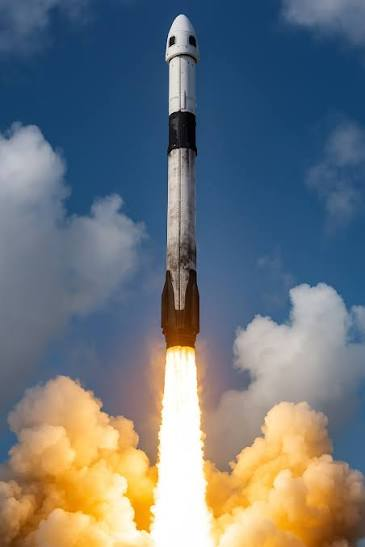

# pyrotechnique

A 3D HDR particle-effect design tool for [Bevy Hanabi](https://github.com/djeedai/bevy_hanabi),
built for both humans and AI agents. Author GPU particle effects as plain
`.effect` RON files, see them live on a real vehicle model in an HDR
bloom-lit atmosphere, and capture deterministic screenshots to compare against
reference photos.

The default example is a SpaceX Falcon 9 flying an animated launch profile
with four layered exhaust effects, tuned against real launch photography (see
`targets/`).



## Stack

| Piece | Version | Why it matters |
|---|---|---|
| Bevy | 0.19 | HDR camera, bloom, procedural atmosphere, screenshot API |
| bevy_hanabi | 0.19 | GPU particles + first-class `.effect` RON serialization |
| bevy_egui | 0.40 | Editor panels |
| bevy_panorbit_camera | 0.35 | Viewport orbit controls |

## Quick start

```bash
# Interactive editor (default scene: Falcon 9 launch)
cargo run

# Deterministic capture of a scenario, with side-by-side vs the target photo
cargo run -- capture --scenario lift-off --compare auto --out shots/liftoff.png

# Regenerate the built-in .effect files + sprite textures from Rust builders
cargo run -- gen-effects
```

Scenarios in the default scene: `lift-off`, `ascent`, `max-q`, `mid-flight`,
`smoke-trail` — each maps to a reference image in `targets/`.

## The agent loop

This tool is built so an AI agent can iterate on effects without a GUI:

```text
1. edit  assets/effects/<name>.effect         (plain RON — gradients, spawner, sizes)
   and/or assets/scenes/falcon9.scene.ron     (emitters, cameras, flight, scenarios)
2. run   cargo run -- capture --scenario <s> --compare auto --out shots/<s>.png
3. look  at shots/<s>_vs_target.png           (capture left, reference right)
4. repeat
```

Captures are simulation-deterministic: fixed timestep (`--fps`), seeded CPU +
GPU RNGs (`--seed`), and the sim clock only starts once every asset is loaded.
(Pixel output can still vary slightly between runs from GPU blend ordering —
about 0.3% mean difference — which does not matter for visual comparison.)

For structural changes (new modifiers, expression graph changes), edit the
builders in `src/effects/builders.rs` and re-run `gen-effects`; for tuning
(colors, sizes, rates, lifetimes) edit the RON directly or use the editor UI.

## Editor (edit mode)

- **Top bar**: play/pause/restart, sim-time scrub, speed, scenario + camera
  preset dropdowns, screenshot, gizmo toggle.
- **Left panel**: emitter list with live intensity multipliers; reference
  image overlay controls.
- **Right panel**: inspector for the selected emitter's effect — spawner rate,
  alpha mode, **HDR color gradient editor** (unit color x intensity multiplier
  per key), size gradient — plus *Save to file* (writes canonical Hanabi RON)
  and *Reload from file*.
- `.effect` files hot-reload when edited externally while the editor runs.
- Restart despawns and respawns emitters, clearing world-space smoke.

## File formats

### Effects: `assets/effects/*.effect`

Hanabi's canonical serialization (`EffectAsset::serialize`). Everything is
editable; the most rewarding knobs are:

- `spawner.count` — particles/second
- `render_modifiers` -> `ColorOverLifetimeModifier.gradient` — HDR RGBA keys
  (values far above 1.0 are intentional: they drive bloom)
- `render_modifiers` -> `SizeOverLifetimeModifier.gradient` — meters
- `init_modifiers` literals live in the `module.expressions` list, referenced
  by `"#N"` handles from modifiers (e.g. lifetime/velocity constants)
- `alpha_mode` — `Add` for flame cores (light), `Blend` for smoke (media)

### Scene: `assets/scenes/*.scene.ron`

Declares the model, environment (sun/exposure/bloom), emitters, flight path,
camera presets, and scenarios. Emitter fields deliberately mirror Elodin's
`thruster` KDL schema (`position`, `direction`, `intensity`) so tuned results
port straight back:

```ron
EmitterConfig(
    name: "merlin_flame",
    effect: "effects/merlin_flame.effect",
    position: (0.0, 0.2, 0.0),       // rocket frame: base center origin, +Y up
    direction: (0.0, -1.0, 0.0),     // exhaust direction
    intensity: 1.0,                  // spawn-rate multiplier
    activity: [(0.0, 1.0), ...],     // optional keyframes over flight time
    attach: "rocket",                // or "world" (e.g. pad smoke)
)
```

Conventions: effects emit along **local -Y**; the emitter entity rotates -Y
onto `direction`. The GLB is auto-normalized (height = `target_height`, base
at origin, +Y up).

## The four built-in effects

| Effect | Space | Blend | Role |
|---|---|---|---|
| `merlin_core` | Local | Add | Blinding white-hot core, HDR ~30x, stretched along velocity |
| `merlin_flame` | Local | Blend | Orange expanding flame column (diverging-cone velocity) |
| `exhaust_smoke` | Global | Blend | Persistent world-space trail; 30-110 s lifetimes, grows to ~500 m |
| `pad_smoke` | Global | Blend | Lift-off ground clouds; radial pad blast + buoyancy, world-attached |

Techniques worth knowing (see `src/effects/builders.rs`):

- **HDR gradients + bloom** make flame read as blinding (firework-example recipe).
- **Diverging cone**: velocity radiates from a virtual center *behind* the
  nozzle -> plume expands downstream like a real underexpanded jet.
- **Per-particle modulation**: random brightness/alpha packed into
  `Attribute::COLOR`, multiplied against the gradient with
  `ColorBlendMode::Modulate` — turns uniform fog into billows.
- **Baked sprite shading**: the smoke sprite carries top-lit lobes + creases
  in RGB, sampled with `ImageSampleMapping::Modulate`.
- **Wide lifetime spread** desynchronizes size-over-life across a trail
  cross-section, breaking up the "uniform tube" look.

## Elodin port path

These `.effect` files are the prototypes for future Elodin `thruster` presets.
Once Elodin moves to Bevy/hanabi 0.19+, its `ThrusterParticlesPlugin`
(`elodin/libs/elodin-editor/src/plugins/thruster_particles/`) can load these
files through `EffectAssetLoader` instead of hard-coding presets, keeping the
same KDL emitter schema this scene format mirrors. See
`docs/crash-course-thruster-particles.md` in the workspace root for the full
Elodin-side picture.

## Layout

```text
src/
├── main.rs        CLI (edit | capture | gen-effects)
├── app.rs         shared app assembly, SimClock
├── render.rs      HDR camera, atmosphere, sun, ground
├── rocket.rs      GLB load + normalization (RocketBounds)
├── flight.rs      flight-path -> rocket transform
├── scene.rs       scene RON schema + sampling helpers
├── capture.rs     deterministic capture state machine + compare composite
├── ui.rs          egui editor panels
└── effects/
    ├── mod.rs         emitter spawning, intensity, hot reload, gizmos
    └── builders.rs    Rust builders for the built-in effects + sprites
assets/
├── effects/       *.effect (Hanabi RON) — the tunable artifacts
├── scenes/        falcon9.scene.ron (+ debug variants)
├── textures/      generated sprites (soft_circle, smoke_puff)
└── models/        Falcon 9 GLB
targets/           reference photos + original model
shots/             capture output (gitignored)
```
